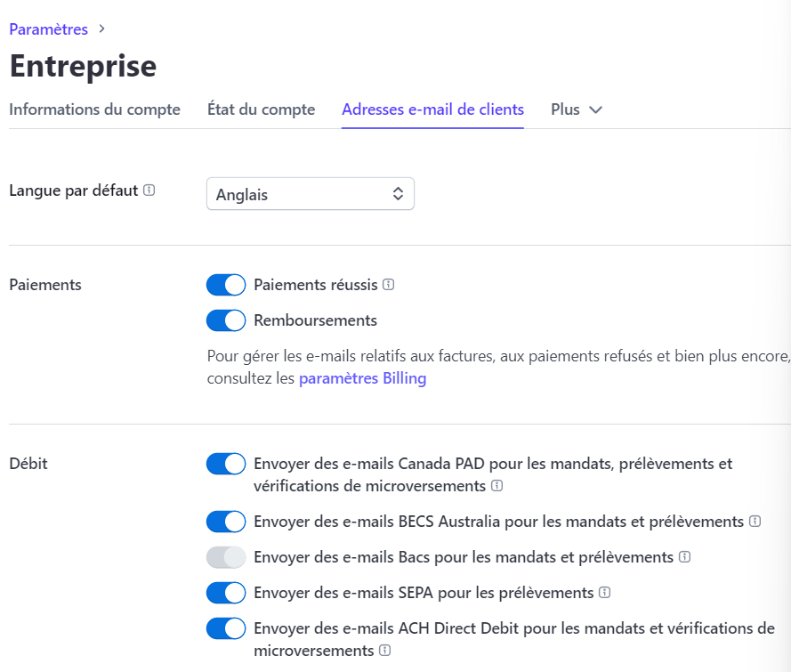

## <u style="background-color: #32325d; color: white;"> Projet Web Réalisé avec HTML/CSS/PHP/JS/STRIPE </u>
 

### Modules installés pour la réalisation du projet :
*****************************************************
###### Stripe :
    composer require stripe/stripe-php

 

### Paramétrage pour l'usage du module de stripe :
*****************************************************

Il faut modifier :
1. Ouvrir un compte stripe depuis <a href="https://stripe.com">**ici**</a>
2. Dans le fichier **/backend/checkout.php** la valeur de **"stripe_secret_key" ligne 4**. Cela permet de perçevoir les paiement sur votre propre compte Stripe.
    ##### NB : Utilisez soit le mode test pour juste effectuer des tests si vous travaillez en local; sinon le mode live.
    ##### Source pour la recherche du token & explication du code : <a href="https://www.youtube.com/watch?v=1KxD8J8CAFg&t=191s">**Explication détaillée.**</a>
3. dans le **/backend/checkout.php** la valeur de **"success_url" ligne 9** par **"http://Your_Domain/pages/success.php"**. Car avec Laragon par exemple, lors du lancement du projet via l'interface de ce dernier on a : **Your_Domain : nom_du_projet.test**
1. Activer l'envoi de mail après paiement réussir :
    
    <u>**Source** </u> : <a href="https://docs.stripe.com/receipts?payment-ui=checkout"> **Documentation pour activer l'envoie de reçu par mail**</a>
    ##### NB: L'envoi de reçus via mail, ne fonctionne qu'avec le mode live.
